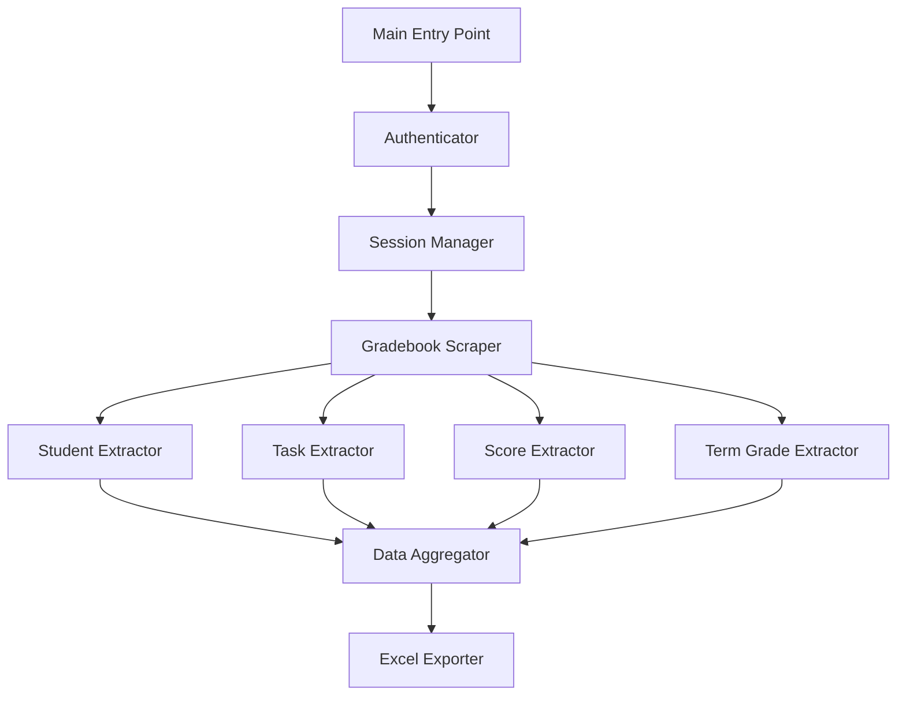

# Design Document: ManageBac Gradebook Scraper

## Overview

This design describes a Python web scraper that authenticates with ManageBac, extracts student gradebook data (names, tasks, criterion scores, comments, and term grades), and exports the data to an Excel file. The scraper uses session-based authentication and BeautifulSoup for HTML parsing.

## Architecture



The architecture follows a modular design:

1. **Authenticator**: Handles login flow and CSRF token extraction
2. **Session Manager**: Maintains cookies across requests with retry logic
3. **Gradebook Scraper**: Orchestrates data extraction from gradebook pages
4. **Extractors**: Specialized modules for each data type
5. **Data Aggregator**: Combines extracted data into a unified structure
6. **Excel Exporter**: Formats and writes data to Excel files

## Components and Interfaces

### Authenticator

```python
class Authenticator:
    def __init__(self, school_code: str, email: str, password: str):
        """Initialize with ManageBac credentials."""
        
    def login(self) -> dict:
        """Authenticate and return session cookies."""
        
    def _extract_csrf_token(self, html: str) -> str:
        """Extract CSRF token from login page."""
```

### SessionManager

```python
class SessionManager:
    def __init__(self, cookies: dict, authenticator: Authenticator):
        """Initialize with session cookies."""
        
    def get(self, url: str, retry_count: int = 3) -> requests.Response:
        """Make authenticated GET request with retry logic."""
```

### Extractors

```python
class StudentExtractor:
    @staticmethod
    def extract(soup: BeautifulSoup) -> list[Student]:
        """Extract student names and IDs from gradebook table."""

class TaskExtractor:
    @staticmethod
    def extract(soup: BeautifulSoup) -> list[Task]:
        """Extract task names and links from gradebook header."""

class ScoreExtractor:
    @staticmethod
    def extract(soup: BeautifulSoup, students: list, tasks: list) -> list[Score]:
        """Extract criterion scores and comments."""

class TermGradeExtractor:
    def extract(self, term_grades_url: str) -> dict[str, str]:
        """Extract term grades from MYP term grades page."""
```

### ExcelExporter

```python
class ExcelExporter:
    @staticmethod
    def export(data: GradebookData, output_path: str) -> None:
        """Export gradebook data to Excel file."""
```

## Data Models

```python
from dataclasses import dataclass
from typing import Optional

@dataclass
class Student:
    id: str
    name: str

@dataclass
class Task:
    id: str
    name: str
    link: str

@dataclass
class Score:
    student_id: str
    task_id: str
    criterion: str  # A, B, C, D
    score: Optional[int]  # None for N/A
    comment: Optional[str]

@dataclass
class TermGrade:
    student_name: str
    grade: str  # 1-8, INC, or N/A

@dataclass
class GradebookData:
    students: list[Student]
    tasks: list[Task]
    scores: list[Score]
    term_grades: list[TermGrade]
    class_name: str
    term_name: str
```


## Error Handling

### Custom Exceptions

```python
class ScraperError(Exception):
    """Base exception for scraper errors."""
    pass

class AuthenticationError(ScraperError):
    """Raised when authentication fails."""
    pass

class ElementNotFoundError(ScraperError):
    """Raised when expected HTML element is not found."""
    def __init__(self, element_description: str, suggestions: list[str]):
        self.suggestions = suggestions
        super().__init__(
            f"Element not found: {element_description}. "
            f"Possible alternatives: {suggestions}"
        )

class SessionExpiredError(ScraperError):
    """Raised when session cookies are no longer valid."""
    pass
```

### Retry Strategy

The SessionManager implements exponential backoff for network failures:

```python
def get_with_retry(self, url: str, max_retries: int = 3) -> Response:
    for attempt in range(max_retries):
        try:
            response = requests.get(url, cookies=self.cookies)
            if self._is_session_expired(response):
                self.cookies = self.authenticator.login()
                continue
            return response
        except RequestException:
            if attempt == max_retries - 1:
                raise
            time.sleep(2 ** attempt)  # Exponential backoff
```

### Element Not Found Handling

When an expected HTML element is not found, the scraper:
1. Logs the missing element with its expected selector
2. Searches for similar elements and suggests alternatives
3. Continues with available data rather than failing completely


## Correctness Properties

*A property is a characteristic or behavior that should hold true across all valid executions of a system—essentially, a formal statement about what the system should do. Properties serve as the bridge between human-readable specifications and machine-verifiable correctness guarantees.*

### Property 1: Student Extraction Completeness

*For any* valid gradebook HTML containing student elements with `data-student` attributes, the StudentExtractor SHALL return a list of Student objects where each student in the HTML has a corresponding Student object with matching id and name.

**Validates: Requirements 2.1, 2.2**

### Property 2: Task Extraction Completeness

*For any* valid gradebook HTML containing task elements with `data-original-title` attributes and anchor hrefs, the TaskExtractor SHALL return a list of Task objects where:
- The count of tasks equals the count of task elements in HTML
- Each task's name matches its `data-original-title` value
- Each task's link matches its anchor href value

**Validates: Requirements 3.1, 3.2, 3.3, 3.4**

### Property 3: Score Extraction Integrity

*For any* valid gradebook HTML containing score elements, the ScoreExtractor SHALL return Score objects where:
- Each score is correctly associated with its student ID and task ID
- Criterion letters (A, B, C, D) are preserved exactly
- Numeric scores are extracted as integers
- Comments from `data-bs-content` are preserved exactly

**Validates: Requirements 4.1, 4.2, 4.3, 4.4, 4.5**

### Property 4: Term Grade Extraction Accuracy

*For any* valid term grades HTML, the TermGradeExtractor SHALL return a mapping where:
- Each student name is correctly paired with their grade
- Numeric grades (1-8) are preserved as strings
- Special values "INC" and "N/A" are preserved exactly

**Validates: Requirements 5.2, 5.3, 5.4, 5.5**

### Property 5: Excel Export Round-Trip

*For any* valid GradebookData object, exporting to Excel and reading back SHALL produce:
- Student names in the first column matching the original data
- Task columns with correct headers
- Score cells in "[Criterion]: [Score]" format
- Term grades in the last column
- Comments preserved in cell notes or adjacent columns

**Validates: Requirements 6.1, 6.2, 6.3, 6.4, 6.5, 6.6**

### Property 6: Session Cookie Persistence

*For any* sequence of authenticated requests, the SessionManager SHALL use the same session cookies obtained from initial authentication for all requests until session expiration.

**Validates: Requirements 1.3**

### Property 7: Retry Behavior

*For any* network request that fails, the SessionManager SHALL:
- Retry up to 3 times before raising an exception
- Use exponential backoff (2^attempt seconds) between retries
- Re-authenticate if session expiration is detected

**Validates: Requirements 7.1, 7.3**

### Property 8: Graceful Degradation

*For any* HTML page missing expected elements, the scraper SHALL:
- Log the missing element with its expected selector
- Continue processing available data
- Include suggestions for alternative selectors in error messages

**Validates: Requirements 7.2, 7.4**

## Testing Strategy

### Property-Based Testing

Use **Hypothesis** as the property-based testing library for Python. Each property test should run a minimum of 100 iterations.

Property tests will use custom strategies to generate:
- Valid HTML structures with student, task, and score elements
- GradebookData objects with varying numbers of students, tasks, and scores
- Edge cases like empty lists, missing attributes, and special grade values

### Unit Tests

Unit tests complement property tests by covering:
- Specific examples of valid ManageBac HTML structures
- Authentication flow with mocked responses
- Error conditions (invalid credentials, network failures, missing elements)
- Excel file format verification

### Test Organization

```
tests/
├── test_authenticator.py      # Auth flow tests
├── test_session_manager.py    # Retry and session tests
├── test_student_extractor.py  # Property tests for student extraction
├── test_task_extractor.py     # Property tests for task extraction
├── test_score_extractor.py    # Property tests for score extraction
├── test_term_grade_extractor.py  # Property tests for term grades
├── test_excel_exporter.py     # Export round-trip tests
└── conftest.py                # Shared fixtures and strategies
```

### Test Annotations

Each property test must be annotated with:
```python
# Feature: managebac-gradebook-scraper, Property N: [Property Title]
# Validates: Requirements X.Y, X.Z
```

